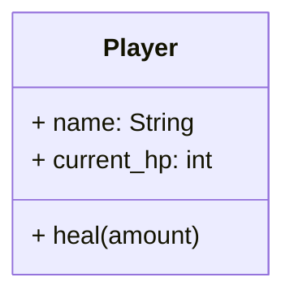
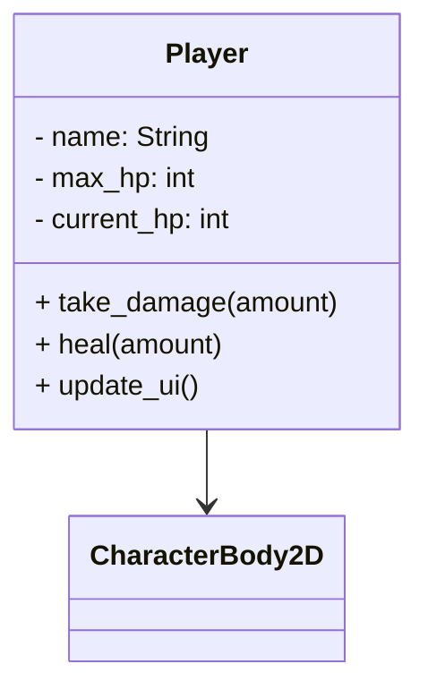

# Module 1: Meet the Hero 🧙

**Hash ID**: `mod01-45c79e6f`

## Overview

Your first quest begins here: creating the hero of your RPG! 
In this module, you’ll define your character using GDScript 4.x, give them stats like health and name, and write methods to heal and take damage. Basically, you're giving life to a digital hero who may or may not survive long enough to regret trusting you.

---

## Learning Objectives

- Understand what a class, property, and method are
- Create a reusable `Player` Scene with UI components
- Write methods for actions like healing or taking damage (or just looking cool doing it)

---

## Understanding Classes, Properties & Methods

In Godot and GDScript, **a class is like a blueprint**. It defines what a thing _is_ and what it _can do_. Think of it as the DNA of your character—minus the awkward adolescence.

### 🧠 RPG Analogy:

> You’re designing a character for a game.
>
> - **Properties** = your hero’s stats: `name`, `HP`, `level`, favorite sandwich...
> - **Methods** = actions like `attack()`, `heal()`, or `run_away_because_you_forgot_armor()`.

Once you create this class, you can spawn heroes like a fantasy-themed vending machine.

### Example in GDScript:

Here's a basic definition of a class with two properties and one method that increases health.

```gdscript
class_name Player

var name: String = "Hero"      # property
var current_hp: int = 100      # property

func heal(amount):             # method
    current_hp += amount
```

### Mermaid Diagram

This shows the class structure in diagram form.



---

## Step-by-Step Guide

### 1. Create the Player Scene 🎨

First, you’ll create the structure of your hero visually in the scene editor.

1. **Create a new scene** with a root node of type `CharacterBody2D`
   (Because heroes have bodies. We checked.)
2. Rename the scene to `Player.tscn`
3. Add the following child nodes:

   - `Sprite2D` → visual representation of your heroic stick figure
   - `ProgressBar` → health meter (a.k.a. the “how doomed am I?” bar)
   - `Label` → shows the player's name or “Sir Punch-a-Lot”

Your scene tree should look like this:

```
Player (CharacterBody2D)
├── Sprite2D
├── ProgressBar
└── Label
```

---

### 2. Attach the Player Script 📜

Now that your hero has a visible presence in the game world, it's time to bring them to life with logic and behavior. We'll attach a script to control the hero's stats and actions like healing and taking damage. This script will also handle updating the health bar and name label. Attach a new script to the root node.

```gdscript
# Player.gd
class_name Player
extends CharacterBody2D

var name: String = "Hero"
var max_hp: int = 100
var current_hp: int = max_hp

func _ready():
    update_ui()

func take_damage(amount: int) -> void:
    current_hp = max(current_hp - amount, 0)
    update_ui()

func heal(amount: int) -> void:
    current_hp = min(current_hp + amount, max_hp)
    update_ui()

func update_ui():
    $ProgressBar.value = current_hp
    $Label.text = name
```

> 🧼 **Clean Code Tip**
> Your function and variable names should _say what they do_.
> ✅ `take_damage()` and `heal()` are easy to read and understand.
> ❌ Avoid names like `hurt_a_bit()` or `maybe_fix()`—unless you’re coding a wizard with commitment issues.

> 🧠 **Bridge to Module 2**
> The UI elements you added here—like the health `ProgressBar` and `Label`—are the same kinds of components you’ll use to display NPC dialogue and other interactions in the next module. You’re already building your UI toolbox!

> 🧼 **Clean Code Tip**
> Functions should do **one thing only**.
> `update_ui()` is a nice little worker bee—it updates the UI and doesn’t get involved in weird side projects.

---

### 3. Test the Player Scene 🧪

Now that your hero has code attached, it's time to see it in action. In this step, you'll run the game and call your methods to make sure the player's stats update correctly—and that the UI responds when your character takes damage or gets healed.

To make sure your code works, test it by calling the methods and watching your health bar respond.

Open a new scene (like `Main.tscn`), instance the `Player`, and call:

```gdscript
$Player.take_damage(25)
```

Watch your health bar shrink. Drama. 🎝
Now try `.heal(10)`. That’s better. Don’t get too confident though—we haven’t even added goblins yet.

---

## Class Structure Diagram 📏

This updated diagram shows your full `Player` class structure:



---

## Challenges ✅

-

> 🧼 **Clean Code Tip**
> Don’t repeat yourself. If you find yourself copying the same code (like calculating “HP: X/Y”), that’s your cue to extract it into a helper function.
> 💡 Bonus: You’ll look cooler. Trust us.

---

## Stretch Goal 💡

Design a new scene called `Knight` that extends `Player` and adds a `defend()` method.
Maybe it halves incoming damage... or maybe it just shouts "FOR GLORY!" and hopes for the best.

---

## Summary 🎓

> 🪄 **Looking Ahead**
> In the next module, you’ll create a `Village.tscn` scene and populate it with NPCs. You’ll also reuse the `Player.tscn` scene you built here—so make sure it’s saved and ready to go! That hero is going places.

You’ve now created your first RPG hero using object-oriented programming! They can take damage, heal, and—thanks to you—not fall apart immediately. That’s a win.

Next up:
[Module 2: Build the Village](/tutorial/modules/02-build-the-village.md)
You’ll give your hero a world to live in and populate it with quirky villagers. Hopefully ones who don’t charge you rent. 🏨
