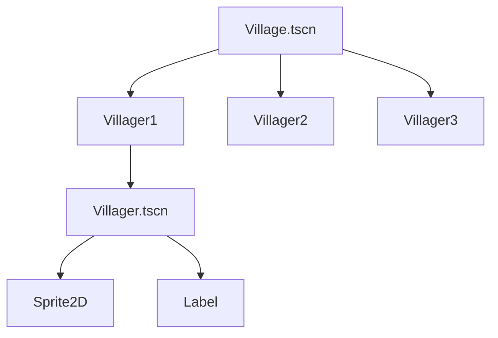

# Module 2: Build the Village 🏨

**Hash ID**: `mod02-ccf7bdb2`

## Overview

Your hero has arrived—but where are the people? In this module, you’ll use the magic of **scene instancing** to build a cozy RPG village. You’ll create a reusable `Villager` class and place multiple versions of it in your world. It’s like cloning NPCs, but ethically.

---

## Learning Objectives

- Understand what instancing is and why it’s awesome
- Create a reusable `Villager` scene and script
- Customize each instance to feel like its own awkward townsperson

---

## RPG Analogy: Copy-Paste with Personality 💬

> Imagine drawing one villager. Now imagine making copies, giving each one a name like “Arlo” or “Suspicious Steve,” and sending them to gossip around town.

That’s what **instancing** is:
You make one base villager (a scene), and then spawn many of them like magical muffins with dialogue.

---

## Step-by-Step Guide

### 1. Create the Villager Scene 🧑‍🌾

1. **Create a new scene** with root node `CharacterBody2D`
2. Name it `Villager.tscn`
3. Add these child nodes:

   - `Sprite2D` → pick a villager sprite (or leave them blank for now, we all start somewhere)
   - `Label` → displays the villager’s name or wise proverb
   - _(Optional)_: `Area2D` + `CollisionShape2D` → for future interaction zones

Your scene tree should look like this:

```text
Villager (CharacterBody2D)
├── Sprite2D
└── Label
```

---

### 2. Write the Villager Script 📜

Now it’s time to give each villager some personality! In this step, you'll create a script that sets their name using an exported variable, so you can customize them easily in the editor without writing unique code for each one. Attach `Villager.gd` to the root node:

```gdscript
# Villager.gd
class_name Villager
extends CharacterBody2D

@export var villager_name: String = "Unnamed Villager"

func _ready():
    $Label.text = villager_name
```

> 🦼 **Clean Code Tip**
> Use `@export` to make your scenes flexible. Now you can change the villager’s name without rewriting the script.
> Reusable = Maintainable = Less crying later.

---

### 3. Add Villagers to the Scene 🎭

Open `Main.tscn` or create a new `Village.tscn`:

1. **Instance** `Villager.tscn` multiple times:

   - Right-click your root node → `Instance Child Scene…` → select `Villager.tscn`

2. Do this 3–4 times for maximum town vibes

3. In the **Inspector**, change the `name` field for each villager:

   - `"Arlo"` (friendly guy)
   - `"Tara"` (flower enthusiast)
   - `"Elder Mo"` (probably knows something important but won’t say it yet)
   - `"Greg"` (just Greg)

4. Move them around with the mouse until your town looks accidentally intentional

---

## Scene Relationship Diagram 📆



> 🦼 **Clean Code Tip**
> Scenes in Godot are like classes in OOP—they let you create reusable templates. You wouldn’t code every villager from scratch, right? (Unless you're into suffering.)

---

### 4. Add Dialogue 💬

Right now, your villagers look great—but they're suspiciously silent. Let's give them something to say! We'll add a `dialogue` variable and use it to display unique text alongside their names on screen.

In `Villager.gd`: like background extras.

In `Villager.gd`:

```gdscript
@export var dialogue: String = "Nice weather today!"

func _ready():
    $Label.text = "%s\n%s" % [name, dialogue]
```

Now in the Inspector, change the `dialogue` property for each instance:

- Arlo → “Did you hear about the slime in the well?”
- Tara → “I can name 14 types of moss.”
- Greg → “…What are you looking at?”

> 🦼 **Clean Code Tip** > `%s` string formatting keeps your code readable and avoids weird + signs everywhere.

---

## Challenges ✅

- [ ] Add a 4th villager named “Mystery Stranger” with a mysterious one-liner
- [ ] Add a `ColorRect` or background behind the label for better visibility
- [ ] Try spacing out your villagers like a believable town, not a dance circle

---

## Stretch Goal 💡

Let’s get fancy with **code-based instancing**.

Create a new scene called `VillagerSpawner.tscn` and attach this script:

```gdscript
# VillagerSpawner.gd
extends Node2D

@export var names := ["Arlo", "Tara", "Elder Mo", "Mystery Stranger"]
@export var villager_scene: PackedScene

func _ready():
    for i in names:
        var new_villager = villager_scene.instantiate()
        new_villager.name = i
        new_villager.position = Vector2(randi() % 300, randi() % 300)
        add_child(new_villager)
```

Steps:

1. Save `Villager.tscn`
2. Drag it into the `villager_scene` export slot in the Spawner node
3. Run your scene and admire your rapidly-growing population

> ⚠️ Don’t spawn too many or your game becomes “Villager Simulator 3000.”

---

## Summary 🎓

You've just leveled up your game with **scene instancing**, **exported variables**, and some very chatty villagers. Now your world feels alive—even if all they do is stand around commenting on the weather.

Next up: we introduce combat, inheritance, and your first enemy encounter. Hope your hero’s health bar is ready. 🗡️💥
