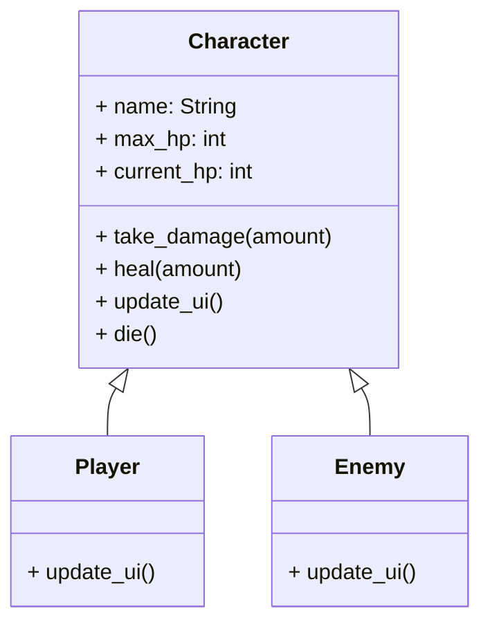

# Module 3: Battle Mechanics ⚔️

**Hash ID**: `mod03-ef9c21a7`

## Overview

The village is peaceful... too peaceful. 🙀
Time to stir things up with enemies, health loss, and possibly yelling. In this module, you’ll learn about **inheritance**, **overriding methods**, and **polymorphism** by creating a shared `Character` base class that both `Player` and `Enemy` inherit from. It's like building a family tree, but one side of it wants to eat you.

---

## Learning Objectives

- Create a base `Character` class with shared logic
- Use **inheritance** to simplify code in `Player` and `Enemy`
- Apply **polymorphism** to make battle code more flexible

---

## RPG Analogy: The Family Tree of Combatants 🌳

> Every character—hero, enemy, boss, Greg—has health, can take damage, and can go “bye-bye.”
> Instead of copying code into every character, we write it once in a parent class and **inherit** the rest. Efficiency + style points!

---

## Step-by-Step Guide

### 1. Create the Character Base Script 📜

To avoid repeating logic in both your Player and Enemy, you’ll define a reusable base class called `Character`. This script will hold shared functionality like taking damage, healing, and dying—and it’ll serve as the blueprint for all future combatants. This step lays the foundation for inheritance and shared combat logic.

Create a new file `Character.gd`:. This will be the wise ancestor of all battle-ready beings., you’ll define a reusable base class called `Character`. This script will hold shared functionality like taking damage, healing, and dying—and it’ll serve as the blueprint for all future combatants.

Create a new file `Character.gd`:. This will be the wise ancestor of all battle-ready beings.

```gdscript
# Character.gd
class_name Character
extends CharacterBody2D

@export var name: String = "Unnamed"
@export var max_hp: int = 100
var current_hp: int

func _ready():
    current_hp = max_hp
    update_ui()

func take_damage(amount: int) -> void:
    current_hp = max(current_hp - amount, 0)
    update_ui()
    if current_hp == 0:
        die()

func heal(amount: int) -> void:
    current_hp = min(current_hp + amount, max_hp)
    update_ui()

func update_ui():
    # Meant to be overridden by child classes
    pass

func die():
    queue_free()  # ☕️ Poof. Gone.
```

> 🦼 **Clean Code Tip**
> Base classes are great for shared behavior, but don’t go overboard. Keep them simple, and offload complex logic to children or components.

---

### 2. Refactor Player to Inherit from Character 🧐

Update `Player.gd` to inherit from `Character` instead of `CharacterBody2D`:

```gdscript
# Player.gd
class_name Player
extends Character

func update_ui():
    $ProgressBar.value = current_hp
    $Label.text = name
```

> 🎉 Now Player gets healing, damage, and death logic _for free_!
> It’s like unlocking all moves in a fighting game without doing the tutorial.

---

### 3. Create an Enemy Scene 👹

Now that your Player inherits from `Character`, let’s create another class that does the same: the Enemy. You’ll build a new scene that uses the shared combat logic from the `Character` base class, but has its own visuals and slightly different UI behavior for variety. that does the same: the Enemy. You’ll build a new scene with its own visuals and UI, but powered by the same combat logic as the Player.

Make a new scene `Enemy.tscn`::

- Root node: `CharacterBody2D`
- Child nodes:

  - `Sprite2D` — scary image
  - `Label` — shows HP or insult

Attach `Enemy.gd`:

```gdscript
# Enemy.gd
class_name Enemy
extends Character

func update_ui():
    $Label.text = "HP: %d" % current_hp
```

You now have two combatants from the same bloodline... but with different looks and attitudes.

---

### 4. Test Combat 💥

Let’s verify that your characters are properly inheriting behavior from `Character.gd`. This step ensures the polymorphic design is working as expected. You’ll place both `Player` and `Enemy` into the scene and simulate combat to observe shared functionality like health updates and the `die()` method in action. from `Character.gd`. You’ll instance both `Player` and `Enemy` in your main scene and simulate taking damage to confirm the UI updates and death logic work as expected.

In `Main.tscn`, instance both a `Player` and an `Enemy`:. Then test their fighting spirit:

```gdscript
func _ready():
    $Player.take_damage(25)
    $Enemy.take_damage(50)
```

> ⚠️ Don’t worry—these are training dummies. Nobody gets permanently hurt (yet).

---

## Class Inheritance Diagram 🧢



> 🦼 **Clean Code Tip**
> Notice how both Player and Enemy override only what they need (UI). This is called **polymorphism**, and it keeps your code flexible and DRY.

---

## Challenges ✅

- [ ] Add a `level` property to `Character.gd` and increase stats each time you level up
- [ ] Override `die()` in `Enemy.gd` to show a death animation (or a dramatic “NOOOOO” sound)
- [ ] Create a second enemy type (`Orc`) using the same Enemy class but with different `max_hp`

---

## Stretch Goal 💡

Create a tiny `CombatManager.gd` to handle attacks between characters:

```gdscript
func attack(attacker: Character, defender: Character, damage: int):
    defender.take_damage(damage)
```

Then run this:

```gdscript
attack($Player, $Enemy, 10)
```

> 🤯 This works whether it's Player attacking Enemy, or vice versa. That’s **polymorphism** in action. The CombatManager doesn’t need to know who’s who—it just trusts the Character interface.

---

## Summary 🎓

You’ve created your RPG battle system using inheritance and clean design.
Now `Player` and `Enemy` are siblings in the `Character` family, sharing code and hopefully not fighting over who gets the last healing potion.

Next: let’s connect your game world together using **signals**—a.k.a. magical notifications that characters can shout across scenes. 📱
