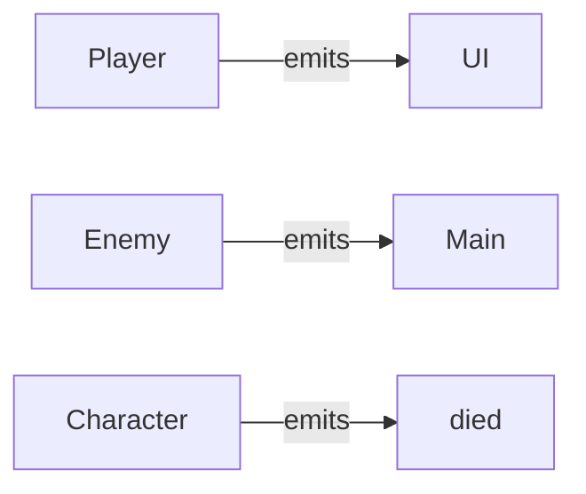

# Module 4: Messaging and Signals 📱

**Hash ID**: `mod04-cb792d95`

## Overview

You’ve got a hero. You’ve got villagers. You’ve got enemies. Now it's time to help them talk to each other—without yelling across the screen like uncivilized code. In this module, you’ll learn how to use **signals**, Godot’s way of saying, “Hey! Something just happened!”

---

## Learning Objectives

- Understand what a **signal** is and when to use one
- Create custom signals in your scripts
- Connect signals in code and the Godot editor
- Use signals to update UI or trigger game logic

---

## RPG Analogy: The Town Gossip 🥜📣

> Imagine your villager sees something happen—like a hero getting smacked by a goblin. They don’t handle it themselves, but they yell,
> _“HEY! THE HERO’S IN TROUBLE!”_
>
> Everyone listening (UI, quest givers, concerned bystanders) reacts accordingly.

That’s a signal. One object **emits**, others **listen** and respond.

---

## Step-by-Step Guide

### 1. Create a Custom Signal 🗪

Let’s add a signal to our `Character.gd` base class. It will broadcast when a character dies:

```gdscript
# Character.gd (add to top)
signal died(character_name)

func die():
    emit_signal("died", name)
    queue_free()
```

> 🦼 **Clean Code Tip**
> A good signal name is short, specific, and sounds like an event. Avoid vague names like `it_happened()`—unless you're coding a mystery game.

---

### 2. Listen for the Signal in Another Script 😊👃

Let’s connect this signal to another node—say, the main scene—so we can react when an enemy is defeated.

```gdscript
# Main.gd
func _ready():
    $Enemy.died.connect(_on_enemy_died)

func _on_enemy_died(character_name):
    print("%s has been defeated!" % character_name)
```

> 🦼 **Clean Code Tip**
> Separate logic by responsibility. Don’t put score logic in the enemy script—handle it in a game manager or controller scene instead.

---

### 3. Use Signals to Update the UI 🖼️

Let’s emit a signal when the player’s HP changes, and use it to update a health bar elsewhere in the scene.

In `Player.gd`:

```gdscript
signal health_changed(current_hp)

func take_damage(amount: int) -> void:
    current_hp = max(current_hp - amount, 0)
    emit_signal("health_changed", current_hp)
    update_ui()
```

Then, in `Main.gd` (or a UI script):

```gdscript
func _ready():
    $Player.health_changed.connect(_on_health_changed)

func _on_health_changed(hp):
    $HealthBar.value = hp
```

🎉 Now the UI stays in sync every time damage is taken—without the UI digging through your player’s internals like a nosy doctor.

---

## Signals vs Direct Calls 🤔

| Method          | Pros                 | Cons                      |
| --------------- | -------------------- | ------------------------- |
| `emit_signal()` | Decouples code ✨    | Harder to trace sometimes |
| `call_method()` | Simple and direct 🔍 | Creates tight coupling    |

> Think of signals as a **walkie-talkie**. You say something once, and whoever’s listening hears it.
> Think of direct calls like **grabbing someone by the shirt and yelling in their face**.

---

## Scene Signal Diagram 📱



---

## Challenges ✅

- [ ] Add a signal for `level_up` in `Player.gd`
- [ ] Connect that signal to the UI to display “LEVEL UP!” when it happens
- [ ] Create a `Villager` that reacts to `Player.died` by shouting something dramatic like “NOOOOO!”

---

## Stretch Goal 💡

Create a `QuestManager.gd` node that listens to multiple signals:

```gdscript
func _ready():
    $Enemy.died.connect(_on_enemy_died)
    $Player.health_changed.connect(_on_player_damaged)

func _on_enemy_died(name):
    print("Quest log: %s was defeated!" % name)

func _on_player_damaged(hp):
    if hp < 30:
        print("Player is low on HP!")
```

You just made your game react like a real RPG system, with logic firing off based on player actions. Next stop: dynamic quests!

---

## Summary 🎓

You’ve just given your game the gift of communication. Using signals, your objects can now react to the world around them, trigger events, and coordinate like a well-oiled party of adventurers—without needing to poke each other directly in memory.

Next up: let’s clean things up, organize our code, and prepare for deeper OOP journeys. 🦼🧠
