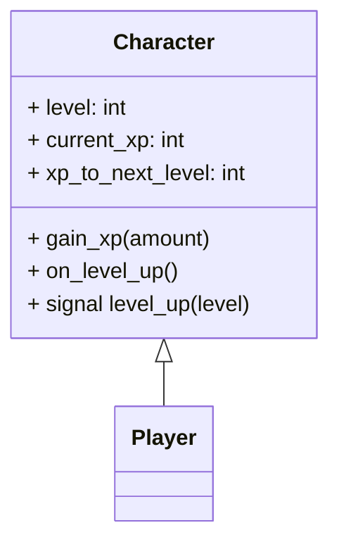

# Module 6: Level Up System 🌟

**Hash ID**: `mod06-d1f7b3c2`

## Overview

Every good RPG needs a sense of progress. Players want to feel like their training montage is paying off. In this module, you’ll implement an **XP and level-up system**, so your hero becomes more powerful over time. By the end, your character won't just take damage—they’ll dish it out harder, better, faster, stronger.

---

## Learning Objectives

- Add XP and level tracking to the player
- Automatically level up when XP reaches a threshold
- Use signals to notify other parts of the game when the player levels up
- Apply Clean Code principles to manage stat growth cleanly

---

## RPG Analogy: 🎓 Growth Spurt Mode

> You start as a potato with a stick. You end up as a sword-wielding legend.
> XP is your reward for not dying. Leveling up is the universe saying “nice job!”

---

## Step-by-Step Guide

### 1. Add XP and Level to Character.gd

To start implementing leveling, we need to track how much experience the player has, what level they are, and when they should level up. This step adds those variables and logic to your `Character.gd` script, including a signal to notify other parts of the game when a level-up happens.

Update your `Character.gd` class with XP, level, and a signal:

```gdscript
# Character.gd
signal level_up(level)

@export var level: int = 1
@export var current_xp: int = 0
@export var xp_to_next_level: int = 100

func gain_xp(amount: int):
    current_xp += amount
    while current_xp >= xp_to_next_level:
        current_xp -= xp_to_next_level
        level += 1
        xp_to_next_level += 50  # Optional: scale difficulty
        emit_signal("level_up", level)
        on_level_up()

func on_level_up():
    max_hp += 10
    current_hp = max_hp
    update_ui()
```

> 🦼 **Clean Code Tip**
> Keep `gain_xp()` focused on math and flow, and delegate the “what happens when you level up” logic to its own method: `on_level_up()`.

---

### 2. Trigger XP Gain in Combat 👡️

Now that your player can gain XP and level up, you need to actually award XP during gameplay. This step modifies your combat logic so the player earns XP when they defeat enemies.

In your combat script or `CombatManager.gd`, reward XP:

```gdscript
func attack(attacker: Character, defender: Character, damage: int):
    defender.take_damage(damage)
    if defender.current_hp <= 0 and attacker is Player:
        attacker.gain_xp(50)
```

> This means enemies don’t just drop dead—they drop knowledge. Kind of.

---

### 3. React to Level Ups 🎉

Once a level-up happens, let’s respond to it! You’ll connect to the `level_up` signal and update the UI or log a message to show the player they’ve advanced.

In your `Main.gd` or `UIController.gd`, connect to the signal:

```gdscript
func _ready():
    $Player.level_up.connect(_on_level_up)

func _on_level_up(level):
    print("You reached Level %d!" % level)
    $LevelLabel.text = "Level: %d" % level
```

Optional: add a flashy sound or animation. 🎆

---

## Class Diagram 📈



---

## Challenges ✅

- [ ] Increase enemy XP reward by difficulty (e.g., Goblin = 20 XP, Orc = 50 XP)
- [ ] Display an XP bar under the health bar
- [ ] Create a `LevelComponent.gd` script and try separating XP logic using composition

---

## Stretch Goal 💡

Give the player stat points to assign when they level up:

- Strength (increases attack)
- Vitality (increases HP)
- Luck (increases… dramatic flair?)

Use export variables and a simple UI menu. Just don’t let them dump all points into “coolness.”

---

## Summary 🎓

Now your hero can grow, improve, and feel rewarded for not face-planting every battle. You’ve introduced real progression into the game—and done it with clean, maintainable code.

Next up: the villagers are talking... it's time to implement a quest system! 📜
