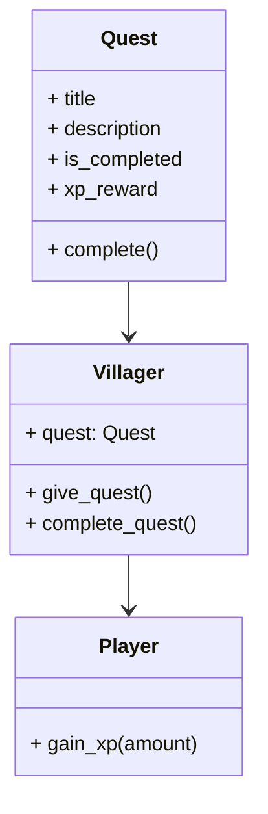

# Module 7: Quest System 📜

**Hash ID**: `mod07-e62a941f`

## Overview

Villagers aren’t just standing around anymore. They have _things_ for your hero to do. In this module, you’ll create a simple **quest system** so your game can support tasks, rewards, and a bit of heroic purpose beyond smacking slimes.

---

## Learning Objectives

- Create a basic `Quest` data structure
- Assign quests to villagers
- Track quest completion
- Connect quests to XP, leveling, or story progression

---

## RPG Analogy: Errand Boy Origins 🏚️

> Ever wonder why heroes are always delivering pies or collecting mushrooms before saving the world? That’s a **quest**. It gives purpose, direction, and sometimes cash.

---

## Step-by-Step Guide

### 1. Create a Quest Class 📰

To begin, we need a structure to hold quest data like its title, description, and XP reward. This `Quest.gd` class will serve as a reusable template for all quests in your game.

```gdscript
# Quest.gd
class_name Quest

var title: String
var description: String
var is_completed: bool = false
var xp_reward: int = 50

func complete():
    is_completed = true
```

> 🦼 **Clean Code Tip**
> Keep quest data simple and separate. Let the `Villager` or `QuestManager` handle logic.

---

### 2. Assign a Quest to a Villager 🧑‍🌾

Now let’s make villagers capable of giving quests to the player. We add an `@export` variable so you can assign a quest in the editor, and include functions to handle giving and completing it.

```gdscript
@export var quest: Quest
signal quest_completed(quest: Quest)

func give_quest():
    if quest and not quest.is_completed:
        print("New quest: %s" % quest.title)

func complete_quest():
    if quest and not quest.is_completed:
        quest.complete()
        emit_signal("quest_completed", quest)
```

Now villagers can _assign_ and _complete_ quests. Just no escort missions. Please.

---

### 3. Handle Quest Rewards 💰

When a quest is completed, let’s give the player some XP as a reward. We connect the villager's `quest_completed` signal to a handler in the main scene (or a manager).

```gdscript
func _ready():
    $Villager.quest_completed.connect(_on_quest_completed)

func _on_quest_completed(quest):
    print("Quest '%s' completed!" % quest.title)
    $Player.gain_xp(quest.xp_reward)
```

> 🦼 **Clean Code Tip**
> The `Player` doesn’t need to know about quests. Decoupling helps you test and extend things later.

---

### 4. Display Quest Info 📃

Let’s make your UI reflect quest progress. Add a `Label` or `QuestLog.tscn` scene that updates when quests are accepted or completed. This keeps the player informed and makes the game feel more alive.

Bonus: add a button to manually complete a test quest for debugging.

---

## Quest Interaction Diagram 📝



---

## Challenges ✅

- ***

## Stretch Goal 💡

Build a simple dialog system that triggers quests. Example:

- Villager: "Hey, my sheep ran away. Want to help?"
- Player: \[Yes] \[No]

Use `RichTextLabel` + buttons, or a plugin from the Asset Library. Drama optional.

---

## Summary 🎓

You now have a functional quest system that gives the hero purpose, structure, and sweet XP rewards. Next up: time to give your enemies some _brains_ with a basic AI system! 🤖
