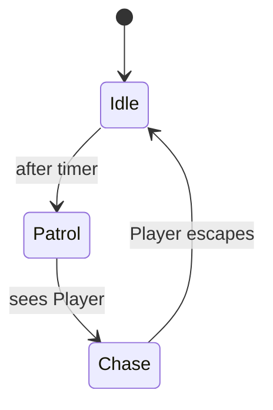

# Module 8: Basic AI System 🤖

**Hash ID**: `mod08-b61d7d44`

## Overview

Your enemies are getting bored standing still. Time to give them some _brains!_ In this module, you'll build a basic AI system to make enemies patrol, detect the player, and chase them. This is your first real dive into simple **state machines** and **timed behaviors**.

---

## Learning Objectives

- Implement simple enemy behaviors (idle, patrol, chase)
- Understand the State pattern via AI states
- Use `Timer`, `Area2D`, and `_process(delta)` for AI logic
- Apply clean separation between AI logic and character stats

---

## RPG Analogy: Goblin Brain Mode 🧠

> Enemies start with one brain cell: "See hero → chase!" Then you add patrol routes and reactions. It's like teaching a goldfish kung fu—one behavior at a time.

---

## Step-by-Step Guide

> 🧠 **OOP Concept Highlight: Abstraction**
> In this module, you're adding new behavior to your enemy without changing how other parts of your code see it. This is called **abstraction**: you hide the complex logic behind simple commands like `state = "patrol"` or `move_and_slide()`. This makes your code easier to read and change later.

### 1. Setup the Enemy Scene

Start with the `Enemy.tscn` scene you built earlier. We’re going to give it AI by adding nodes and structure.

1. Add a `Timer` node called `PatrolTimer`
2. Add an `Area2D` node called `DetectionArea`, and inside it:

   - Add a `CollisionShape2D` (set to a large circle)

3. Create and attach `EnemyAI.gd` script to the root node of the enemy

---

### 2. Write the AI Script 🧠

This script will control the enemy’s behavior using simple states. We’ll use a string for state switching and add a timer-based patrol.

```gdscript
# EnemyAI.gd
extends CharacterBody2D

var state: String = "idle"
var patrol_speed := 40
var chase_speed := 90
@export var player_path: NodePath

func _ready():
    $PatrolTimer.start()

func _process(delta):
    match state:
        "idle":
            # stand still, wait
            pass
        "patrol":
            position.x += patrol_speed * delta
        "chase":
            if player_path:
                var player = get_node(player_path)
                var direction = (player.global_position - global_position).normalized()
                velocity = direction * chase_speed
                move_and_slide()

func _on_PatrolTimer_timeout():
    state = "patrol"
```

---

### 3. Detect the Player 🕵️

Make your enemy switch to "chase" mode when the player is in range.

```gdscript
func _on_DetectionArea_body_entered(body):
    if body.name == "Player":
        state = "chase"
```

And don’t forget to connect the `body_entered` signal in the editor.

> 🧼 **Clean Code Tip**
> Keep AI decision logic _separate_ from stats like health and XP. Your `Character.gd` should not care what mood the enemy is in.

---

### 4. State Machine Diagram 🗺️



---

## Challenges ✅

- [ ] Add a `flee` state if the enemy is low on HP
- [ ] Create a `PatrolPath` with waypoints
- [ ] Add animation changes based on state

---

## Stretch Goal 💡

Extract each AI state into its own class (like `IdleState.gd`, `PatrolState.gd`, etc.) and dynamically switch between them. You’ll basically build your own mini **State pattern** framework.

---

## Summary 📘

You’ve now added a brain to your goblins! They can patrol, detect, and chase—without any hard-coded hero love. This lays the foundation for smarter behaviors and modular game AI.

Next up: **Inventory & Items**—let’s give our hero some loot! 🎒
