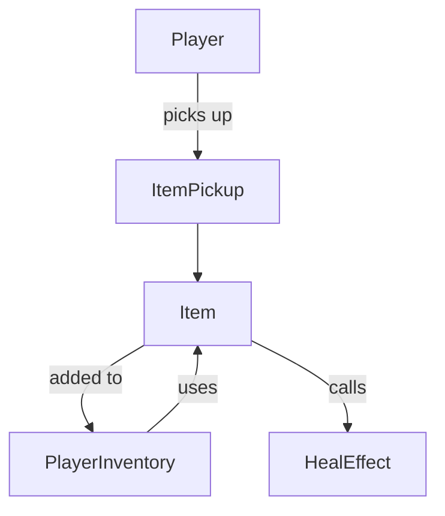

# Module 9: Inventory and Items 🎒

**Hash ID**: `mod09-2e3a4a6f`

## Overview

Your hero is finally tired of eating potions directly off the ground. It’s time for an **inventory system**! In this module, you’ll build a simple inventory where the player can collect, store, and use items like healing potions, keys, and more.

---

## Learning Objectives

- Create a basic inventory using arrays or dictionaries
- Add collectible items to the world
- Allow using items with effects (e.g. heal, unlock)
- Explore component-based design for item behavior

---

## RPG Analogy: Backpack of Holding 🛋

> Every hero needs a backpack full of questionable loot. You'll build that backpack. Hopefully it has room for more than 20 carrots and a magic spoon.

---

## Step-by-Step Guide

### 1. Design the Item Class 📃

Each item in the world should be its own class. This allows us to easily reuse item behavior and create modular effects like healing or unlocking doors. In this step, you'll write a simple script that defines what an item is, what it looks like, and how it behaves when used. We'll start with a basic script that represents a generic inventory item.

> 🧠 **OOP Concept Highlight**
> When you call `use(target)` on different types of items, each item can respond in its own way. This is an example of **polymorphism**—even though the method name is the same, the behavior can vary based on the object. For example, a potion heals, a key unlocks, and a cursed scroll might do... something spicy.

```gdscript
# Item.gd
class_name Item

@export var item_name: String = "Potion"
@export var description: String = "Heals 20 HP"
@export var icon: Texture2D
@export var effect_type: String = "heal"
@export var effect_amount: int = 20

func use(target):
    if effect_type == "heal":
        target.heal(effect_amount)
```

> 🧼 **Clean Code Tip** > `Item.gd` focuses only on what it _is_ and what it _does_. Don’t clutter it with how it’s displayed.

---

### 2. Add the Inventory to the Player 💼

Time to make our player carry stuff. In this step, you’ll add an `inventory` array to the Player, and define methods to add new items when collected and use them later. The `add_item()` function appends new items to the inventory, while `use_item()` allows the player to activate an item’s effect and remove it from the list once used.

```gdscript
# Player.gd
var inventory: Array[Item] = []

func add_item(item: Item):
    inventory.append(item)

func use_item(index: int):
    if index < inventory.size():
        var item = inventory[index]
        item.use(self)
        inventory.remove_at(index)
```

---

### 3. Make Items Collectible 🪜

Create an `ItemPickup.tscn` scene with a `CollisionShape2D` and `Sprite2D`. This scene represents an item lying around in the world that the player can walk into to pick up. When the player enters the item's collision area, it will call `add_item()` on the player and then disappear. Then attach this logic:

```gdscript
# ItemPickup.gd
@export var item: Item

func _on_body_entered(body):
    if body.has_method("add_item"):
        body.add_item(item)
        queue_free()
```

> ⚠️ Connect the `body_entered` signal from an `Area2D` node.

---

### 4. Inventory UI (Optional) 📊

Add a simple vertical box (`VBoxContainer`) with buttons or icons representing the items. On button press, call `use_item(index)`.

You could even use `GridContainer` and `TextureButton`s to make a grid.

> 🧼 **Clean Code Tip**
> Keep UI and data logic separated. Inventory UI should never _hold_ the data—just display it.

---

### 5. Component Idea (Stretch!) 🔧

Extract the `use()` logic into separate scripts:

- `HealEffect.gd`
- `KeyEffect.gd`

Each item could then be a node with a child `effect` that defines its behavior. This leads into a **component system**.

---

## Inventory Flow Diagram 📊



---

## Challenges ✅

- [ ] Add stackable items (e.g. 3 potions)
- [ ] Add hotkeys to use first inventory slot
- [ ] Drop item from inventory back into the world

---

## Summary 🎓

Now your hero can hoard potions responsibly. You built a reusable inventory system and explored the start of **composition over inheritance** with item behaviors.

Next up: **Saving & Loading**—because losing your loot is just cruel. 😢
