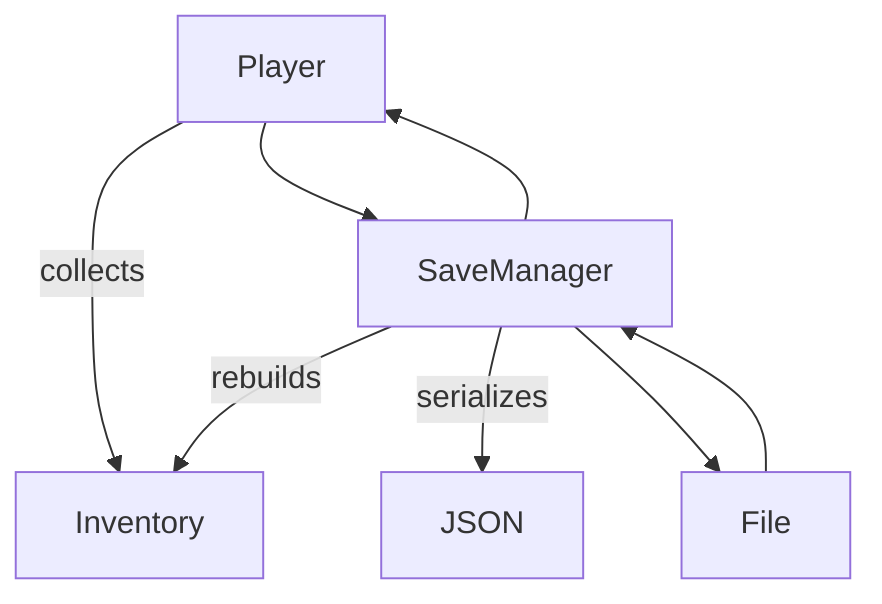

# Module 10: Saving and Loading 💾

**Hash ID**: `mod10-519b6f28`

## Overview

After all that effort collecting carrots and slaying goblins, the worst thing that can happen is… closing the game and losing everything. Let’s fix that! In this module, you’ll implement a **save/load system** using Godot’s built-in `FileAccess` and JSON.

---

## Learning Objectives

- Serialize data using dictionaries and JSON
- Save and load game state using `FileAccess`
- Understand the basics of persistence in games
- Apply the Singleton pattern for save management

---

## RPG Analogy: Magical Diary 📘

> You’re giving your hero a magical diary that remembers everything: where they are, what they have, and how many dragons they've definitely _not_ run away from.

---

## Step-by-Step Guide

### 1. Create the SaveManager Singleton 🧠

First, create a new script that will manage saving and loading player data such as health, level, and inventory. This script will handle writing the current game state to a file and reading it back later. Then add it as an Autoload Singleton so it can be accessed from anywhere in your game—making it super convenient to trigger saves or loads from any scene or UI element.

```gdscript
# SaveManager.gd
extends Node

var save_path := "user://savegame.json"

func save_game(player):
    var data = {
        "hp": player.current_hp,
        "level": player.level,
        "inventory": []
    }

    for item in player.inventory:
        data["inventory"].append(item.item_name) # Keep it simple

    var file = FileAccess.open(save_path, FileAccess.WRITE)
    file.store_string(JSON.stringify(data))
    file.close()

func load_game(player):
    if not FileAccess.file_exists(save_path):
        return

    var file = FileAccess.open(save_path, FileAccess.READ)
    var data = JSON.parse_string(file.get_as_text())
    file.close()

    if typeof(data) != TYPE_DICTIONARY:
        return

    player.current_hp = data["hp"]
    player.level = data["level"]
    # Inventory reloading to be added below
```

> 🧼 **Clean Code Tip**
> Keep your SaveManager small and dumb. Don’t let it start inventing logic—it should just move data.

---

### 2. Add Save and Load Buttons 🖱️

Add two buttons to your UI: `Save` and `Load`. Connect them to call `SaveManager.save_game($Player)` and `SaveManager.load_game($Player)` respectively.

---

### 3. Restore Inventory Items 🎒

To actually reload the inventory, you’ll need a way to rebuild `Item` instances from strings—since you only saved the item names. This step shows how to use a simple factory pattern, where each item name corresponds to a preloaded scene. That way, when loading the game, we can recreate the full item objects (with behaviors and visuals) and return them to the player’s inventory.

```gdscript
# Somewhere in SaveManager or ItemFactory
var item_db = {
    "Potion": preload("res://items/Potion.tscn"),
    "Key": preload("res://items/Key.tscn")
}

func rebuild_inventory(player, names: Array[String]):
    for name in names:
        if item_db.has(name):
            var item = item_db[name].instantiate()
            player.add_item(item)
```

Then add this to `load_game()`:

```gdscript
rebuild_inventory(player, data["inventory"])
```

> 🧼 **Clean Code Tip**
> Avoid hardcoding too much inside SaveManager—keep a separate ItemFactory if this grows.

---

### 4. Saving Position (Optional) 📍

Add position info to the save file:

```gdscript
"position": player.global_position
```

And restore it:

```gdscript
player.global_position = data["position"]
```

---

## Save Flow Diagram 💾



---

## Challenges ✅

- [ ] Save and load active quests
- [ ] Add a timestamp or version number to the save
- [ ] Auto-save after combat or quest completion

---

## Summary 📘

Now your hero can stop mid-adventure without losing progress. You built a save system, explored the basics of file IO, and used simple serialization for state management. Feels good, right?

This wraps up the **core tutorial**—but your adventure is just beginning! 🚀
