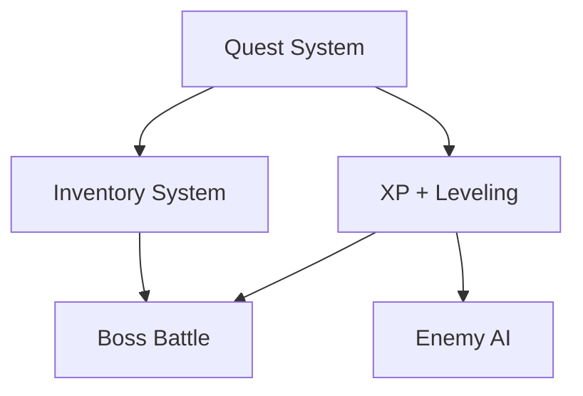

# ✨ Next Steps: Level Up Your Game

You've finished building your first RPG engine—great job, adventurer! 🧙
Now that you understand the foundations of object-oriented programming, here are some feature ideas to expand your game and sharpen your skills. These are written as **user stories**, just like developers use in real-world Agile teams.

---

## 📋 Feature Ideas (User Stories)

### 1. Simple Quest System

> 🧑‍🌾 _As a player, I want to accept a quest from a villager, so I feel like I have a purpose in the game._

- Add a `QuestGiver` scene with a `QuestComponent`
- Display quest status on screen (e.g., “Defeat 3 goblins”)
- Use signals to mark quest completion

---

### 2. XP + Leveling Up System

> 💪 _As a player, I want to earn XP by defeating enemies, so I can level up and feel stronger._

- Add an `xp` and `level` property to `Character.gd`
- Create a `gain_xp(amount)` method
- Add visual feedback when the player levels up

> 🦼 **Clean Code Tip**
> Keep leveling logic separate from combat logic—SRP in action!

---

### 3. Inventory & Item Pickup

> 🎒 _As a player, I want to collect items in my inventory, so I can use them later (or just hoard them forever)._

- Create an `InventoryComponent`
- Add pickup zones (Area2D) and signals for item collection
- Show items in a simple UI list

---

### 4. Enemy AI Movement

> 👹 _As a player, I want enemies to chase me if I get too close, so the game feels more dynamic._

- Add basic state machine logic: IDLE → CHASE
- Use distance checks with `Player` position
- Keep logic small and testable (don’t put everything in `_process()`!)

---

### 5. Add a Boss Battle

> 🦟‍♂️ _As a player, I want to fight a boss with unique attacks and higher HP, so I can feel like I’ve reached a climax._

- Create a new scene `Boss.tscn` with extra animations and logic
- Inherit from `Enemy.gd` and override attack behavior
- Add cutscene or effects on entry or death

---

## 🗌 Suggested Roadmap

---

### 🧠 Learn Agile, Lightly

Real developers often think like this:

- “What does the user want to do?” → write a **user story**
- “What do I need to build to support that?” → break it into **tasks**
- “Can I deliver it in small, working pieces?” → work in **iterations**

> You're already doing this—you're just doing it with more goblins and fewer spreadsheets.

---

### 🗜️ Your Journey Continues...

Want more challenges?

- Rebuild the game as a turn-based combat system
- Add a world map and transition between zones
- Create a dialogue tree with choices (hello, branching logic!)
- Refactor everything using a component-based design (pure composition)
- Try writing tests for your methods and logic (Test-Driven RPG?! 🤯)
